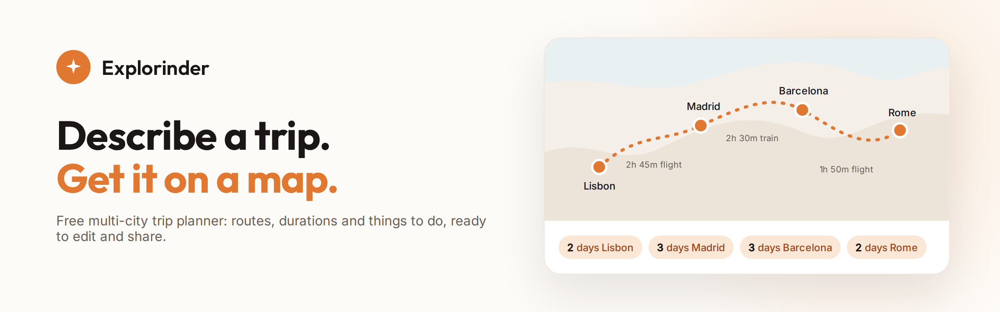

### Building

<table>
  <tr>
    <td width="50%" valign="top">
      
      <h4><a href="https://explorinder.com">Explorinder</a></h4>
      A free trip planner. Describe a multi-city trip and get a full itinerary on a map, with routes, durations and things to do, ready to edit and share.
    </td>
    <td width="50%" valign="top">
      
      <h4><a href="https://github.com/pablocaeg/sloptotal">SlopTotal</a> </h4>
      An open-source AI text detector. 23 detectors behind one calibrated score, measured on a public benchmark of 3,252 texts from 14 current models.
    </td>
  </tr>
</table>
